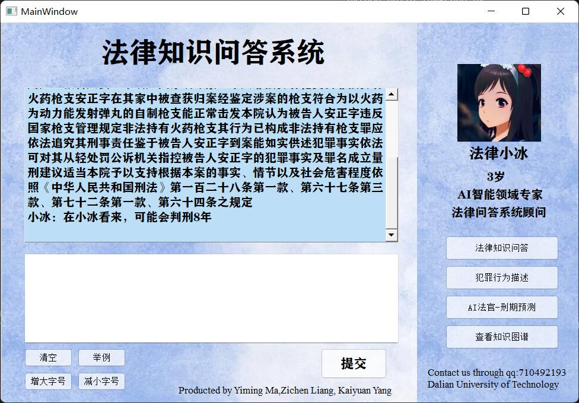

# Legal Knowledge Q & A based on neo4j

Yiming Ma, Zichen Liang, Kaiyuan Yang from Dalian University of Technology <p>
Contact us at QQ group: 710492193


## 1. Preparation
### a. Install dependent packages
```
pip install -r requirements.txt
```
### b. Download and install neo4j, you can refer to [Installation guide for neo4j](https://blog.csdn.net/zeroheitao/article/details/122925845)

### c. Set the parameters to your own in config.yaml, especially the neo4j password.

### d. Download the pretrained model for sentence prediction [Pretrained model](http://pan.dlut.edu.cn/share?id=x16mx9t22axf). And Put it in the predict folder or the folder you specify.


## 2. Build your legal knowledge map in neo4j
```
python build_lawgraph.py
```
## 3. Now you can start running
```
python run.py
```
### The first run may take a long time because you need to download the trained model.

## 4. Results



